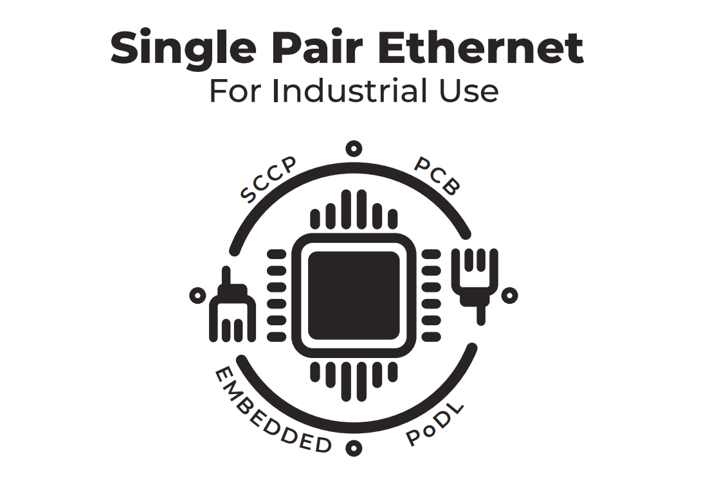

# Single Pair Ethernet For Industrial Use

## KICAD
KICAD PCB design files for the LTC4296-1 PSE prototype and LTC9111 PD prototype.

## SCCP 

SCCP_2 uses SPI to communicate with the LTC4296-1 prototype. 

See program print for features. 

SCCP classification between LTC4296-1 and LTC9111 can be performed as well.

## ADIN1110 - Development with STM32Cube IDE.

MCU Firmware : STM32L4xx - https://github.com/STMicroelectronics/STM32CubeL4 

LL DRIVERS : ADIN1110 Support files by Analog Devices.

TCP/IP : LWIP 2.1.2 & Callback API from LWIP. 

Serial Monitor : USART.c & USART.h, huart1.Init.BaudRate = 115200

ADC : INIT in Main.c & stm32l4xx_hal_msp.c

Client-side GUI CONCEPT PROTOTYPE - Python, Added as placeholder for showcase.

